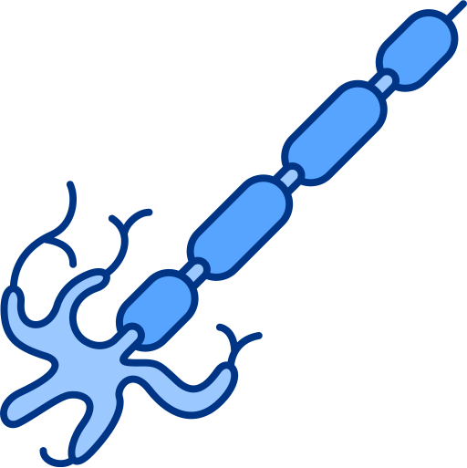
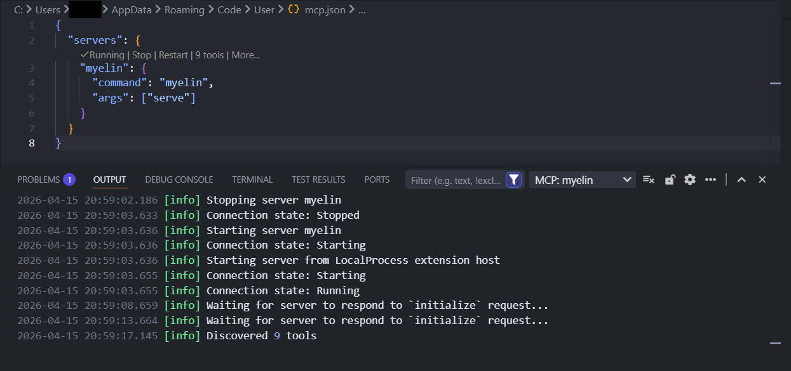
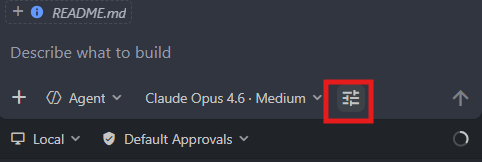
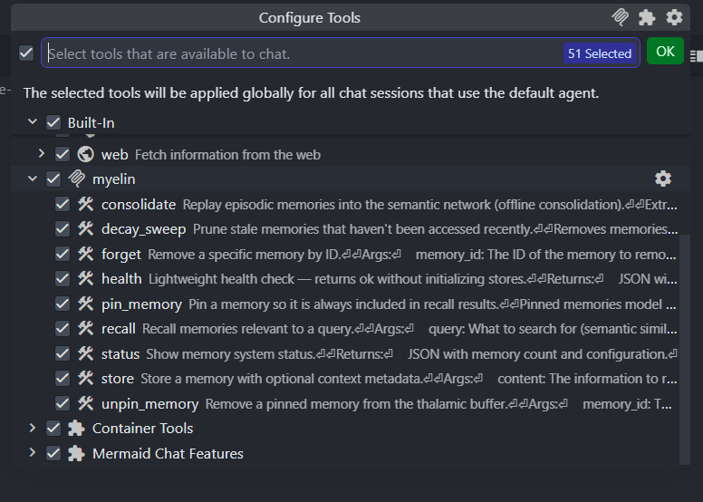

<p align="center">
  
</p>

# Myelin

**Neuromorphic long-term AI memory** — brain-inspired persistent context for AI agents.

Myelin gives AI tools (GitHub Copilot, Claude, Cursor) a local, private memory system modeled after how the human brain stores and retrieves information. It encodes context, strengthens with use, separates patterns, and prunes what fades — no LLM calls, no API keys, fully offline.

## Table of Contents

- [Why Myelin](#why-myelin)
- [Quick Start](#quick-start)
- [Setup Guides](#setup-guides)
  - [Personal (Cross-Project)](#personal-cross-project)
  - [Per-Repository](#per-repository)
  - [Team / Cloud](#team--cloud)
- [Teaching Your Agent](#teaching-your-agent)
- [Results](#results)
- [How It Works](#how-it-works)
- [CLI & MCP Tools](#cli--mcp-tools)
- [Inspecting Your Data](#inspecting-your-data)
- [Configuration](#configuration)
- [Neuroscience Mapping](#neuroscience-mapping)
- [Development](#development)
- [Contributing](CONTRIBUTING.md)
- [References](#references)

---

## Why Myelin

**The problem:** Every AI agent conversation starts from scratch. Context is lost between sessions, across tools, across projects. Agents repeat mistakes, forget decisions, and can't build on prior work.

**What Myelin does:**

- **Persistent memory across sessions** — decisions, patterns, and debugging insights survive after the chat window closes
- **Cross-agent context** — Copilot, Claude, and Cursor share the same memory. What one agent learns, all agents can recall.
- **Cross-project knowledge** — architectural patterns from project A inform decisions in project B
- **Self-organizing** — auto-classifies memory types (decisions, procedures, events), auto-infers recall filters, auto-prunes stale knowledge
- **Private and local** — all data stays on your machine (or your team's server). No API keys. No cloud dependency. No data leaving your network.
- **Gets better with use** — frequently co-recalled memories strengthen their association (Hebbian learning). The more you use it, the better recall gets.
- **98.2% Recall@5 on LongMemEval** — beats LLM-based systems using only local 22M-parameter models

---

## Quick Start

### Requirements

- Python 3.11+
- ~500 MB disk for models (downloaded automatically on first run)
- No GPU required — runs on CPU
- **No API keys or tokens** — all models are public, everything runs locally

### Install

Myelin uses **two directories** in your home folder — both are created during setup:

| What | Path (Windows) | Path (macOS/Linux) |
|---|---|---|
| **Virtual environment** (Python, uv, Myelin code) | `C:\Users\<you>\.myelin-venv\` | `~/.myelin-venv/` |
| **Data directory** (memories, embeddings, DBs) | `C:\Users\<you>\.myelin\` | `~/.myelin/` |

The venv is created manually (Step 1). The data directory is created automatically on first run.

> **Common error:** `spawn …\.myelin-venv\Scripts\uv.exe ENOENT` means the venv hasn't been created yet or `uv` isn't installed inside it. Follow all steps below.

#### Step 1 — Create a persistent virtual environment

This venv must live in your **home directory** — not inside any project folder. This ensures it's always available regardless of which repo you're working in.

> **Windows gotcha:** Use `$env:USERPROFILE` (PowerShell) — **not** `%USERPROFILE%` (that's CMD syntax and will create a broken literal folder name in PowerShell).

**Windows (PowerShell):**
```powershell
python -m venv $env:USERPROFILE\.myelin-venv
& $env:USERPROFILE\.myelin-venv\Scripts\Activate.ps1
```
This creates `C:\Users\<you>\.myelin-venv\` in your home directory.

**macOS/Linux:**
```bash
python3 -m venv ~/.myelin-venv
source ~/.myelin-venv/bin/activate
```
This creates `~/.myelin-venv/` (e.g., `/home/<you>/.myelin-venv/` or `/Users/<you>/.myelin-venv/`).

> You should see `(.myelin-venv)` in your terminal prompt after activating. If you don't, the venv wasn't created — check the path.

#### Step 2 — Install uv and Myelin inside the venv

With the venv **activated** (from Step 1):

```bash
pip install uv
uv pip install git+https://github.com/et-do/myelin.git
```

#### Step 3 — Verify the installation

Still in the activated venv:

```bash
uv run myelin status
```

On the first run, this downloads ~500 MB of embedding models. It may take a minute. You should see JSON output like:

```json
{
  "memory_count": 0,
  "summary_count": 0,
  "consistent": true,
  "data_dir": "~/.myelin",
  "embedding_model": "all-MiniLM-L6-v2"
}
```

#### Step 4 — Configure your AI tool

Add Myelin as an MCP server so your agent can use it. See [Setup Guides](#setup-guides) below for full details.

**VS Code (user-level — recommended):**

Open Command Palette (`Ctrl+Shift+P`) → `Preferences: Open User Settings (JSON)` → click the MCP icon (the Configure Tools button in the chat input bar), or manually edit:
- **Windows:** `C:\Users\<you>\AppData\Roaming\Code\User\mcp.json`
- **macOS/Linux:** `~/.config/Code/User/mcp.json`

```json
{
  "servers": {
    "myelin": {
      "command": "uv",
      "args": ["run", "myelin", "serve"]
    }
  }
}
```

> **Important (Windows):** VS Code resolves `"command": "uv"` by searching your PATH. Make sure `uv.exe` is findable — either by adding the venv's `Scripts` folder to your PATH (Step 5), or by using the full path in the config:
> ```json
> "command": "C:\\Users\\<you>\\.myelin-venv\\Scripts\\uv.exe"
> ```

**Claude Desktop:** Add the same `command`/`args` to your `claude_desktop_config.json`.

#### Step 5 — Make `uv` findable by VS Code

VS Code doesn't activate your venv — it needs to find `uv` on its own. Pick **one** of these options:

**Option A: Use full paths in mcp.json (no admin / no PATH changes)**

This works on locked-down work machines where you can't modify environment variables. Just use absolute paths in your MCP config (Step 4):

**Windows:**
```json
{
  "servers": {
    "myelin": {
      "command": "C:\\Users\\<you>\\.myelin-venv\\Scripts\\uv.exe",
      "args": ["run", "myelin", "serve"]
    }
  }
}
```

**macOS/Linux:**
```json
{
  "servers": {
    "myelin": {
      "command": "/Users/<you>/.myelin-venv/bin/uv",
      "args": ["run", "myelin", "serve"]
    }
  }
}
```

> Replace `<you>` with your actual username. This is the most reliable option — it works regardless of PATH, admin rights, or shell configuration.

**Option B: Add the venv to your PATH**

This lets you use the short `"command": "uv"` form everywhere.

*Windows (User variables — no admin required):*
1. Press `Win + S`, type **environment variables**, select **Edit the system environment variables**
2. Click **Environment Variables…**
3. Under **User variables** (top section, not System), select `Path` → **Edit…** → **New**:
   ```
   %USERPROFILE%\.myelin-venv\Scripts
   ```
   > Editing User variables does **not** require admin. System variables (bottom section) does.
4. Click **OK** on all dialogs. **Restart VS Code** for the change to take effect.

*macOS/Linux:* Add to your shell profile (`~/.bashrc`, `~/.zshrc`, etc.):
```bash
export PATH="$HOME/.myelin-venv/bin:$PATH"
```

#### Step 6 — Restart and confirm

1. **Restart VS Code** (or reload the window: `Ctrl+Shift+P` → `Developer: Reload Window`).
2. Open the **Output** panel (`Ctrl+Shift+U`), select **MCP: myelin** from the dropdown. You should see it start and discover tools:

<p align="center">
  
</p>

3. Click the **Configure Tools** button (filter icon) in the Chat input bar to verify Myelin's tools are listed:

<p align="center">
  
</p>

<p align="center">
  
</p>

4. Ask your agent: *"Check myelin status"* — it should call the `status` tool and return memory counts.

---

## Setup Guides

Myelin stores all data in a single directory (`~/.myelin` by default). How you deploy that directory determines the scope of memory.

### Personal (Cross-Project)

**Best for:** Solo developers who want one memory across all projects and agents.

This is the default setup. Follow the [Quick Start Install](#install) steps above — they set up user-level config by default.

All projects and agents share `~/.myelin/`. Use `project` metadata when storing to keep knowledge organized:

```
"Store this as project=backend, scope=auth"
```

Recall can filter by project or search across everything.

### Per-Repository

**Best for:** Teams who want memory scoped to a single repo, committed alongside the code.

**1. Set `MYELIN_DATA_DIR` to a path inside the repo:**

Create a `.vscode/mcp.json` in the repo:

```json
{
  "servers": {
    "myelin": {
      "command": "uv",
      "args": ["run", "myelin", "serve"],
      "env": {
        "MYELIN_DATA_DIR": "${workspaceFolder}/.myelin"
      }
    }
  }
}
```

**2. Decide whether to commit the data:**

- **Commit `.myelin/`** — the team shares accumulated knowledge (architectural decisions, conventions, debugging history). New contributors inherit project memory. Good for stable, curated knowledge.
- **Gitignore `.myelin/`** — each developer builds their own memory. Add `.myelin/` to `.gitignore`. Good for personal workflow memory you don't want to share.

**3. Add agent instructions** (see [Teaching Your Agent](#teaching-your-agent) below).

### Team / Cloud

**Best for:** Organizations that want shared memory across team members and CI environments.

Myelin itself is a local process — it reads/writes to a data directory. For team sharing, you point that directory at shared storage. This does not require deploying Myelin as a hosted service.

**Option A: Shared network drive or mounted volume**

Point `MYELIN_DATA_DIR` to a shared filesystem (NFS, SMB, EFS, GCS FUSE, etc.):

```bash
export MYELIN_DATA_DIR=/mnt/team-memory/myelin
```

SQLite uses WAL mode and file-level locking, which works on most network filesystems for light concurrency. For heavy concurrent writes, consider Option B.

**Option B: Sync via export/import**

Use the CLI to periodically export and import memory between environments:

```bash
# On one machine — export
uv run myelin export team-memory.json

# On another machine — import
uv run myelin import team-memory.json
```

This can be automated in CI (e.g., export after each deploy, import at dev environment setup).

**Option C: Shared server (future)**

A dedicated Myelin server with HTTP transport is on the roadmap. For now, the export/import workflow covers most team use cases.

---

## Teaching Your Agent

Connecting the MCP server gives your agent the *ability* to store and recall — but it won't use memory automatically unless you tell it to.

### Agent Instructions

Add a `.github/copilot-instructions.md` (VS Code / Copilot) or equivalent instructions file to your project:

```markdown
## Memory

You have access to a long-term memory system (Myelin) via MCP tools.

### When to Recall
- At the START of every task, recall relevant context about the current project,
  file, or problem domain.
- Before making architectural decisions, recall past decisions and their rationale.
- When debugging, recall similar past issues and their resolutions.

### When to Store
- After making significant decisions — record WHAT was decided and WHY.
- After resolving non-trivial bugs — record the symptoms, root cause, and fix.
- When discovering project conventions, patterns, or gotchas.
- After completing a meaningful feature — summarize the approach and trade-offs.

### How to Store Effectively
- Always include `project` metadata (e.g., project="myapp").
- Use `scope` to organize by domain (e.g., scope="auth", scope="database").
- Use `tags` for cross-cutting concerns (e.g., tags="performance,optimization").
- Use `memory_type` when it's clear: "semantic" for decisions/facts,
  "procedural" for how-to, "episodic" for events, "prospective" for plans.
- Be specific. "We use JWT RS256 because asymmetric keys let the API gateway
  verify without the signing secret" is better than "We use JWT."

### Maintenance
- After extended sessions (10+ stores), run `consolidate` to build the
  semantic network — improves recall by linking related entities.
- Consolidation auto-triggers every 50 stores, but running it manually
  after a burst of activity gives immediate benefit.
- Periodically run `decay_sweep` to prune stale memories (90+ days idle,
  <2 accesses).

### What NOT to Store
- Trivial or ephemeral information (typo fixes, one-off commands).
- Exact code blocks — store the reasoning, not the implementation.
- Anything sensitive (secrets, credentials, PII).
```

### Tips for Effective Memory

- **Use `project` consistently.** It's the primary organizational axis. An agent working on "myapp" should always store with `project="myapp"` so recall can filter by project.
- **Pin critical context.** Use `pin_memory` for things every session should know (system architecture, active conventions, team preferences). Pinned memories are prepended to every recall result.
- **Run consolidation periodically.** `uv run myelin consolidate` (or it auto-runs every 50 stores) builds the semantic network — entity relationships that improve recall quality over time.
- **Run decay periodically.** `uv run myelin decay` prunes memories that haven't been accessed in 90+ days with fewer than 2 accesses. Keeps the memory clean without manual curation.
- **Export before major changes.** `uv run myelin export backup.json` creates a full backup you can restore with `import`.

---

## Results

### LongMemEval_S — 500 questions, zero LLM calls

[LongMemEval](https://github.com/xiaowu0162/LongMemEval) (ICLR 2025) tests long-term conversational memory: can the system find the right conversation session given a natural-language question? **R@k** measures whether *any* ground-truth session appears in the top-k results (binary hit).

| Metric | Myelin | MemPalace (GPT-4o) |
|--------|--------|---------------------|
| **R@1** | **91.2%** | — |
| **R@3** | **98.0%** | — |
| **R@5** | **98.2%** | 96.6% |
| **R@10** | **98.2%** | — |
| **NDCG@5** | **95.2%** | — |
| LLM calls | 0 | requires GPT-4o |

98.2% R@5 (491/500 questions) using only local models — no LLM calls. Exceeds MemPalace's 96.6% R@5 which relies on GPT-4o.

#### Per-Category Breakdown

| Category | Questions | R@1 | R@5 |
|----------|-----------|-----|-----|
| knowledge-update | 78 | 97.4% | **100.0%** |
| single-session-assistant | 56 | 100.0% | **100.0%** |
| single-session-user | 70 | 88.6% | **100.0%** |
| multi-session | 133 | 91.0% | 98.5% |
| temporal-reasoning | 133 | 90.2% | 96.2% |
| single-session-preference | 30 | 70.0% | 93.3% |

### LoCoMo — 1,986 questions, 10 conversations

[LoCoMo](https://github.com/snap-research/locomo) (Snap Research) tests memory over long conversations. Stricter metric: **R@k** = fraction of *all* evidence sessions found in top-k (not binary hit). Multi-evidence questions require retrieving multiple sessions simultaneously.

| Metric | Myelin | MemPalace hybrid v5 |
|--------|--------|---------------------|
| **R@5** | **74.1%** | — |
| **R@10** | **83.6%** | 88.9% |
| **R@20** | **83.6%** | — |

### Methodology

- **LongMemEval**: [LongMemEval_S cleaned](https://huggingface.co/datasets/xiaowu0162/longmemeval-cleaned) — 500 questions, 6 categories (ICLR 2025). Oracle mode, chunks deduplicated to sessions.
- **LoCoMo**: 10 conversations, 1,986 QA pairs. R@k = fraction of evidence sessions found in top-k.
- **Models**: `all-MiniLM-L6-v2` (22M params) + `cross-encoder/ms-marco-MiniLM-L-6-v2` (22M params)
- **Hardware**: 8-core CPU, no GPU
- **LLM calls**: Zero in retrieval

---

## How It Works

### Core Concepts

| Concept | Neuroscience | Myelin Equivalent |
|---------|-------------|-------------------|
| **Cortical Region** | Specialized brain areas for different domains | `project` — each project is a distinct neural territory |
| **Engram Cluster** | Co-active neurons forming a memory trace | `scope` — related memories (auth, billing) share a cluster |
| **Memory System** | Distinct encoding/retrieval strategies | `memory_type` — episodic, semantic, procedural, prospective |
| **Association Fiber** | White matter connecting co-active regions | Hebbian links — built from co-retrieval patterns |
| **Gist Trace** | Meaning and detail stored in parallel | Vector embedding (gist) + raw content (verbatim) |
| **Sparse Code** | Only 1-5% of neurons fire per stimulus | Chunking — each segment is a focused representation |

### Memory Systems

| System | `memory_type` | What It Stores | Example |
|--------|---------------|----------------|---------|
| **Episodic** | `episodic` | Events with temporal context | "What happened when we deployed?" |
| **Semantic** | `semantic` | Decisions, facts, knowledge | "What did we decide for auth?" |
| **Procedural** | `procedural` | Habits, preferences, how-to | "How do we run migrations?" |
| **Prospective** | `prospective` | Future plans, recommendations | "What are the next steps?" |

### Pipeline Overview

```
STORE (fast, zero-LLM)              RECALL (multi-probe)

  content                              query
    │                                    │
    ▼                                    ▼
  Amygdala ─── reject noise          Query Planner ─── auto-infer filters
    │                                    │
    ▼                                    ▼
  Prefrontal ── auto-classify         Multi-probe (3 query variants)
    │                                    │
    ▼                                    ▼
  Chunking ──── pattern separation    Per-probe retrieval
    │                                    │ dual-path search + re-rank
    ▼                                    ▼
  Entorhinal ── context coordinates   Pool merge + cross-encoder re-score
    │                                    │
    ▼                                    ▼
  Perirhinal ── gist extraction       Spreading activation + lateral inhibition
    │                                    │
    ▼                                    ▼
  Hippocampus ─ embed + store         Return top-k
```

### Post-Recall

| Component | Module | What It Does |
|-----------|--------|-------------|
| **Hebbian Boost** | `recall/activation.py` | Co-retrieved memories strengthen mutual links |
| **Thalamus Overlay** | `store/thalamus.py` | Prepends pinned memories, tracks recency |
| **Decay Sweep** | `recall/decay.py` | TTL pruning of unrehearsed, low-access memories |

### Consolidation (offline)

| Component | Module | What It Does |
|-----------|--------|-------------|
| **Entity Extraction** | `store/consolidation.py` | Regex-based extraction of names, tech identifiers, terms |
| **Semantic Network** | `store/neocortex.py` | Entity graph with weighted co-occurrence edges |
| **Auto-trigger** | `server.py` | Fires every `consolidation_interval` stores |

### Detailed Walkthrough

#### Storing: `"We decided to use JWT with RS256 for the auth service"`

**1. Amygdala** — `store/amygdala.py` (input gate)
- Content is 54 chars — passes `min_content_length` (20)
- Embeds content and queries ChromaDB for nearest neighbors
- Max similarity < `dedup_similarity_threshold` (0.95) — not a duplicate
- → **Accepted**

**2. Prefrontal Cortex** — `store/prefrontal.py` (schema classification)
- Matches content against **5 schema templates**, each with 4–5 regex marker patterns:
  - `decision` → semantic (markers: "decided", "chose", "went with", "agreed on", …)
  - `preference` → procedural (markers: "always", "prefer", "convention", "style guide", …)
  - `procedure` → procedural (markers: "step 1", "how to", "deploy/build/test", …)
  - `plan` → prospective (markers: "TODO", "next steps", "roadmap", "going to", …)
  - `event` → episodic (markers: "yesterday", "debugged", "incident", "happened", …)
- `"decided"` fires the **decision** schema → `memory_type = "semantic"`
- Confidence = fraction of markers that fire (1/5 = 0.2 — one match is enough)
- No match → defaults to `"episodic"`

**3. Chunking** — `store/chunking.py` (pattern separation)
- Content is 54 chars — well under `chunk_max_chars` (1000) → stored as a single memory
- For longer content:
  - **Conversation detection**: looks for role markers (`user:`/`assistant:`) or named speakers (`Caroline:`, `Dr. Smith:`)
  - **Exchange-pair splitting**: keeps user + assistant turns together
  - **Topic-shift detection**: computes keyword overlap (Jaccard) between adjacent turns — when overlap drops below **15%**, forces a new chunk boundary
  - **Text fallback**: overlapping segments (**200-char overlap**) split at paragraph boundaries
- Embedding model has a 256-token window (~1000 chars) — chunking ensures every segment fits

**4. Entorhinal Cortex** — `store/entorhinal.py` (context coordinates)
- **LEC pathway** — topic keywords:
  - Term-frequency extraction on non-stop-words → top 5 keywords
  - → `ec_topics`: `["jwt", "rs256", "auth", "service"]`
- **MEC pathway** — domain region:
  - Matches against **6 region classifiers** (each a regex pattern set):
    - `technology` — code, api, database, docker, python, react, sql, …
    - `security` — auth, jwt, oauth, encrypt, token, password, rbac, …
    - `health` — doctor, diagnosis, fitness, prescription, therapy, …
    - `finance` — budget, invest, mortgage, tax, billing, invoice, …
    - `personal` — birthday, family, vacation, recipe, pet, wedding, …
    - `work` — meeting, sprint, deadline, roadmap, onboarding, …
  - Requires **≥2 pattern hits** to assign (avoids false positives)
  - `"auth"` + `"jwt"` → `ec_region`: `"security"`
- **Speaker detection** — "who" pathway:
  - Extracts named speakers from `"Name:"` patterns at line start
  - Filters generic roles (`user`, `assistant`, `human`, `ai`, `system`, `bot`)
  - → `ec_speakers`: e.g., `["Caroline", "Dr. Smith"]`

**5. Perirhinal Cortex** — `store/perirhinal.py` (gist extraction)
- **Extractive summarisation** (no LLM) — scores each sentence by:
  - Signal regex hits (decisions, state changes, personal facts, life events, activities)
  - Named entity rarity — names/places appearing in only 1–2 sentences score higher
- Selects top sentences up to ~200 chars
- → Gist embedding stored in a **separate ChromaDB summary collection**, linked to parent session via `parent_id`

**6. Hippocampus** — `store/hippocampus.py` (episodic store)
- Encodes content → **384-dim vector** via `all-MiniLM-L6-v2`
- Stores in ChromaDB with full metadata:
  - `memory_type`, `project`, `scope`, `tags`
  - `ec_topics`, `ec_region`, `ec_speakers`
  - `session_date`, `parent_id`
- → Returns memory ID: `"mem_a1b2c3"`

---

#### Recalling: `"What auth approach did we pick?"`

**1. Query Planner** — `recall/query_planner.py` (auto-filter inference)
- Matches query against regex patterns to infer **memory_type**:
  - `semantic` — "what did we decide/choose", "what is/was", "definition of"
  - `procedural` — "how do/does", "prefer/convention/style"
  - `episodic` — "when did/what happened", "yesterday/last week", "who said"
  - `prospective` — "what should", "plan/next/todo", "roadmap/deadline"
- Matches query against **10 scope patterns**: `auth`, `database`, `deploy`, `security`, `testing`, `api`, `frontend`, `backend`, `billing`, `monitoring`
- `"What … did we pick"` → `memory_type = "semantic"`, `scope = "auth"`

**2. Multi-Probe** — `store/hippocampus.py` (3 query variants)
- **Probe 1**: original query — `"What auth approach did we pick?"`
- **Probe 2**: keyword-focused — top 8 extracted keywords joined as text
- **Probe 3**: entity-expanded — spreads seed keywords through the neocortex entity graph, appends related entities discovered via co-occurrence

**3. Per-Probe Retrieval** (×3, each runs the full sub-pipeline)

Each probe passes through these stages:

- **a. Perirhinal gist search** (`store/perirhinal.py`) — queries the summary collection for familiar sessions, returns top-k `parent_id`s ranked by gist similarity
- **b. Dual-pathway ChromaDB search** (`store/hippocampus.py`):
  - *Filtered path*: applies auto-inferred `memory_type` + `scope` as ChromaDB `where` clause
  - *Unfiltered path*: applies only explicit params (`project`, `language`)
  - Merges by lowest distance per ID — prevents auto-filters from excluding relevant results
- **c. Entorhinal re-rank** (`store/entorhinal.py`) — keyword overlap boost:
  - `score *= 1.0 + entorhinal_boost (0.3) × Jaccard overlap`
  - If query mentions a known speaker name: `score *= 1.0 + speaker_boost (0.2)`
- **d. Perirhinal gist boost** — sessions matching gist search:
  - `score *= 1.0 + perirhinal_boost (0.5) × gist similarity`
- **e. Gist retrieval pathway** — injects best chunks from high-scoring gist sessions (batch ChromaDB lookup by `parent_id`)
- **f. Cross-encoder re-ranking** (`store/hippocampus.py`) — blends CE and bi-encoder scores:
  - `score = α × CE_normalized + (1-α) × bi_normalized` where `α = neocortex_weight (0.6)`
- **g. Time-cell boost** (`recall/time_cells.py`) — detects temporal expressions (`"3 days ago"`, `"last Tuesday"`, `"in March"`) with ± buffer windows (±1 day for days, ±3 for weeks, ±7 for months):
  - Recency formula: `boost = 2^(-age_days / half_life_days)`
  - Additive: `score += temporal_boost (0.6)` for date-range matches
- **h. Lateral inhibition** (`store/hippocampus.py`) — max `lateral_k` (1) result per session/scope, keeps highest-scoring per group

**4. Multiprobe Merge** — `store/hippocampus.py`
- Pools all candidates from 3 probes, keeps best score per memory ID
- Re-scores merged pool with cross-encoder against original query (at `α/2` blending weight to preserve per-probe rankings)
- Soft recency gradient: `score *= 1.0 + 0.1 × 2^(-age / half_life)`

**5. Spreading Activation** — `store/neocortex.py` (entity graph boost)
- Extracts entities from top results, walks the neocortex entity graph (co-occurrence edges, max 2 hops, distance-decayed propagation)
- `score *= 1.0 + spreading_boost (0.15) × activation`

**6. Session Evidence Aggregation**
- Groups results by session — sessions with multiple retrieved chunks get a logarithmic boost:
  - `score *= 1.0 + log1p(chunk_count - 1) × agg_boost`
- Applied to top chunk per session — rewards sessions with broad evidence coverage

**7. Lateral Inhibition** (final pass)
- Enforces session diversity one more time after merge + boosts
- Max `lateral_k` (1) result per session

**8. Return top-5**

| Result | Score |
|--------|-------|
| "We decided to use JWT with RS256 for the auth service" | 0.94 |
| "RS256 key rotation runs every 90 days" | 0.71 |
| … | … |

**Post-recall:**
- **Hebbian LTP** (`recall/activation.py`) — co-retrieved memories strengthen mutual links: `weight += hebbian_delta` per pair, future boost = `hebbian_scale × log1p(weight)`
- **Thalamus overlay** (`store/thalamus.py`) — prepends any pinned memories (L0 identity/system context, L1 critical facts) to every result set

---

## CLI & MCP Tools

### CLI

```bash
uv run myelin status       # Health + integrity check
uv run myelin serve        # Start MCP server (stdio)
uv run myelin decay        # Prune stale memories
uv run myelin consolidate  # Replay episodes into semantic network
uv run myelin export out.json  # Export all memories to JSON
uv run myelin import out.json  # Import memories from JSON
```

### MCP Tools

| Tool | Description |
|---|---|
| `store` | Encode a memory with context metadata (auto-classifies type, auto-chunks, 500K char limit) |
| `recall` | Retrieve by semantic similarity (auto-inferred filters, multi-probe, Hebbian boost, 10K char limit) |
| `forget` | Remove a specific memory by ID |
| `pin_memory` | Pin a memory — always included in recall results |
| `unpin_memory` | Remove a pin |
| `decay_sweep` | Prune stale memories (access-based TTL) |
| `consolidate` | Replay episodes into the semantic network |
| `status` | Memory system health check (counts, configuration) |
| `health` | Lightweight liveness probe (ok + version, no store initialization) |

### Data Storage

All data lives in `~/.myelin/` (configurable via `MYELIN_DATA_DIR`). The full path depends on your OS:
- **Windows:** `C:\Users\<you>\.myelin\`
- **macOS:** `/Users/<you>/.myelin/`
- **Linux:** `/home/<you>/.myelin/`

Contents:

| File | Purpose |
|---|---|
| `chroma/` | Vector database (ChromaDB) — embeddings and metadata |
| `hebbian.db` | Co-access patterns between memories |
| `neocortex.db` | Semantic network — entities and relationships |
| `thalamus.db` | Pinned memories and recency tracking |

SQLite files use WAL mode for concurrent read performance.

### Inspecting Your Data

You can inspect and validate the contents of your Myelin databases directly.

#### Quick health check

```bash
uv run myelin status
```

Returns memory count, summary count, consistency status, data directory, and model info.

#### Export all memories to readable JSON

```bash
uv run myelin export memories.json
```

This dumps every memory with its full metadata (content, timestamps, access counts, memory type, project, scope, tags, etc.) into a single JSON file you can open in any editor.

#### Browse SQLite databases directly

The `.db` files are standard SQLite databases. You can open them with any SQLite tool:

```bash
# Hebbian co-access links (which memories are associated)
sqlite3 ~/.myelin/hebbian.db ".tables"
sqlite3 ~/.myelin/hebbian.db "SELECT * FROM hebbian_links ORDER BY weight DESC LIMIT 10;"

# Semantic network (entities and relationships built by consolidation)
sqlite3 ~/.myelin/neocortex.db ".tables"
sqlite3 ~/.myelin/neocortex.db "SELECT * FROM entities LIMIT 10;"
sqlite3 ~/.myelin/neocortex.db "SELECT * FROM edges ORDER BY weight DESC LIMIT 10;"

# Pinned memories and recency tracking
sqlite3 ~/.myelin/thalamus.db ".tables"
sqlite3 ~/.myelin/thalamus.db "SELECT * FROM pinned;"
sqlite3 ~/.myelin/thalamus.db "SELECT * FROM recency ORDER BY last_accessed DESC LIMIT 10;"
```

> **Tip:** On Windows, you can install `sqlite3` via `winget install SQLite.SQLite` or use [DB Browser for SQLite](https://sqlitebrowser.org/) for a GUI. The `sqlite-utils` package (included with Myelin) also works: `sqlite-utils tables ~/.myelin/hebbian.db` and `sqlite-utils rows ~/.myelin/hebbian.db hebbian_links --limit 10`.

#### Browse the ChromaDB vector store

ChromaDB stores embeddings and metadata in `~/.myelin/chroma/`. You can query it programmatically:

```python
import chromadb
client = chromadb.PersistentClient(path="~/.myelin/chroma")
collection = client.get_collection("memories")

# Count all memories
print(collection.count())

# Peek at the first 5 memories
results = collection.peek(limit=5)
for doc, meta in zip(results["documents"], results["metadatas"]):
    print(meta.get("memory_type"), "-", doc[:100])
```

#### What to look for

| Check | What It Tells You |
|---|---|
| `myelin status` shows `consistent: true` | Embedding count matches metadata count — no orphans |
| `myelin export` has entries with your project name | Memories are being tagged correctly |
| `hebbian.db` has rows | Co-recall learning is active (fires after multiple recalls) |
| `neocortex.db` has entities/edges | Consolidation has run and built the semantic network |
| `thalamus.db` pinned table has rows | You have pinned memories that prepend to every recall |

---

## Configuration

All parameters use environment variables with a `MYELIN_` prefix. Defaults work out of the box.

### Storage Parameters

| Parameter | Default | What It Controls |
|-----------|---------|-----------------|
| `data_dir` | `~/.myelin` | Where all data lives |
| `embedding_model` | `all-MiniLM-L6-v2` | Bi-encoder model (384-dim, 22M params) |
| `chunk_max_chars` | `1000` | Max characters per chunk |
| `chunk_overlap_chars` | `200` | Overlap between text chunks |
| `min_content_length` | `20` | Minimum chars to pass the input gate |
| `dedup_similarity_threshold` | `0.95` | Above this = near-duplicate, rejected |

### Recall Parameters

| Parameter | Default | What It Controls |
|-----------|---------|-----------------|
| `default_n_results` | `5` | Results returned to caller |
| `recall_over_factor` | `8` | Over-retrieval multiplier for re-ranking headroom |
| `multiprobe` | `true` | 3-probe retrieval (original + keywords + entity-expanded) |
| `neocortex_rerank` | `true` | Cross-encoder re-ranking |
| `neocortex_weight` | `0.6` | CE/bi-encoder blend (0.0–1.0) |
| `cross_encoder_model` | `ms-marco-MiniLM-L-6-v2` | Cross-encoder model (22M params) |
| `lateral_k` | `1` | Max results per session/scope (0 = off) |

### Boosting Parameters

| Parameter | Default | What It Controls |
|-----------|---------|-----------------|
| `entorhinal_boost` | `0.3` | Keyword overlap multiplier |
| `speaker_boost` | `0.2` | Speaker mention multiplier |
| `perirhinal_boost` | `0.5` | Gist-match multiplier |
| `perirhinal_top_k` | `10` | Gist summaries to search |
| `temporal_boost` | `0.6` | Temporal reference boost (additive, after CE) |
| `recency_half_life_days` | `180` | Soft recency gradient half-life |

### Spreading Activation Parameters

| Parameter | Default | What It Controls |
|-----------|---------|-----------------|
| `spreading_activation` | `true` | Entity-graph post-retrieval boost |
| `spreading_boost` | `0.15` | Per-entity activation multiplier |
| `spreading_max_depth` | `2` | Max hops in entity graph |
| `spreading_top_k` | `10` | Max related entities to activate |

### Maintenance Parameters

| Parameter | Default | What It Controls |
|-----------|---------|-----------------|
| `max_idle_days` | `90` | Days of inactivity before pruning eligibility |
| `min_access_count` | `2` | Accesses needed to survive pruning |
| `hebbian_delta` | `0.1` | Co-access weight increment |
| `hebbian_scale` | `0.1` | Logarithmic boost scale |
| `thalamus_recency_limit` | `20` | Recency buffer size |
| `consolidation_interval` | `50` | Auto-consolidate every N stores |
| `log_level` | `INFO` | Logging verbosity (structured JSON to stderr) |

---

## Neuroscience Mapping

| Myelin Component | Brain Region | Principle | Fidelity |
|-----------------|-------------|-----------|----------|
| `store/hippocampus.py` | Hippocampus | Rapid one-shot encoding, pattern completion | **High** |
| `store/chunking.py` | Dentate Gyrus | Sparse coding / pattern separation | **High** |
| `store/prefrontal.py` | Prefrontal Cortex | Schema-consistent encoding | **High** |
| `recall/query_planner.py` | Prefrontal Cortex | Inhibitory gating | **High** |
| `store/neocortex.py` | Temporal Neocortex | Spreading activation | **High** |
| `store/consolidation.py` | Sleep replay | CLS theory | **High** |
| `store/amygdala.py` | Amygdala | Significance gating | **Medium** |
| `store/entorhinal.py` | Entorhinal Cortex | Context coordinates | **Medium** |
| `store/perirhinal.py` | Perirhinal Cortex | Familiarity signaling | **Medium** |
| `store/thalamus.py` | Thalamus | Sensory relay + attention | **Medium** |
| `recall/activation.py` | Synapses | Hebbian LTP | **Medium** |
| `recall/time_cells.py` | Hippocampal time cells | Temporal context | **Medium** |
| `recall/decay.py` | Synapse pruning | Ebbinghaus forgetting curve | **Low** |

**Faithfully modeled:** CLS (fast hippocampal encode + slow neocortical consolidation), pattern separation, spreading activation, encoding specificity, retrieval-induced inhibition, Hebbian learning.

**More metaphorical:** No neural dynamics (spiking, LTP/LTD). Amygdala is an importance scorer, not emotional valence. Consolidation is triggered, not sleep-driven.

---

## Development

```bash
git clone https://github.com/et-do/myelin.git
cd myelin
uv sync --extra dev
uv run pre-commit install
uv run pytest -v --cov=myelin
```

A Dev Container config is included — open in VS Code and "Reopen in Container" for a zero-setup environment.

See [CONTRIBUTING.md](CONTRIBUTING.md) for the full workflow: branching, conventional commits, automated releases, benchmarking, and project structure.

---

## References

| Principle | Paper | Used In |
|-----------|-------|---------|
| Schema-consistent encoding | [Tse et al. (2007). *Science*](https://doi.org/10.1126/science.1135935) | `store/prefrontal.py` |
| Spreading activation | [Collins & Loftus (1975). *Psych. Review*](https://doi.org/10.1037/0033-295X.82.6.407) | `store/neocortex.py` |
| Complementary learning systems | [McClelland et al. (1995). *Psych. Review*](https://doi.org/10.1037/0033-295X.102.3.419) | `store/consolidation.py` |
| Retrieval-induced inhibition | [Anderson & Green (2001). *Nature*](https://doi.org/10.1038/35066572) | `recall/query_planner.py` |
| Encoding specificity | [Tulving & Thomson (1973). *Psych. Review*](https://doi.org/10.1037/h0036255) | Metadata filters |
| Schema augmented memory | [van Kesteren et al. (2012). *Trends in Neurosciences*](https://doi.org/10.1016/j.tins.2012.02.001) | Schema detection |
| Hebbian learning | [Hebb (1949). *The Organization of Behavior*](https://en.wikipedia.org/wiki/Hebbian_theory) | `recall/activation.py` |
| Sleep and memory | [Rasch & Born (2013). *Physiological Reviews*](https://doi.org/10.1152/physrev.00032.2012) | `store/consolidation.py` |

## License

MIT
